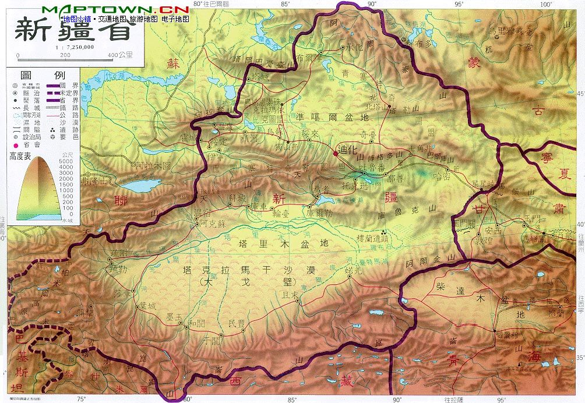
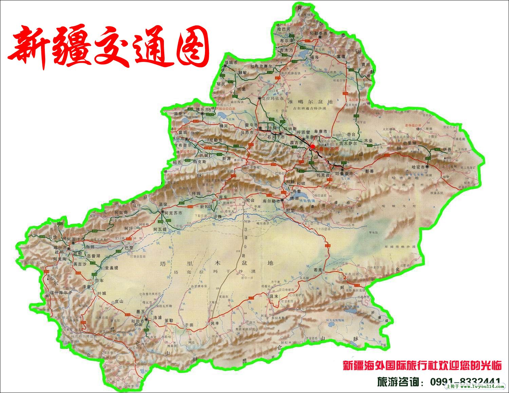
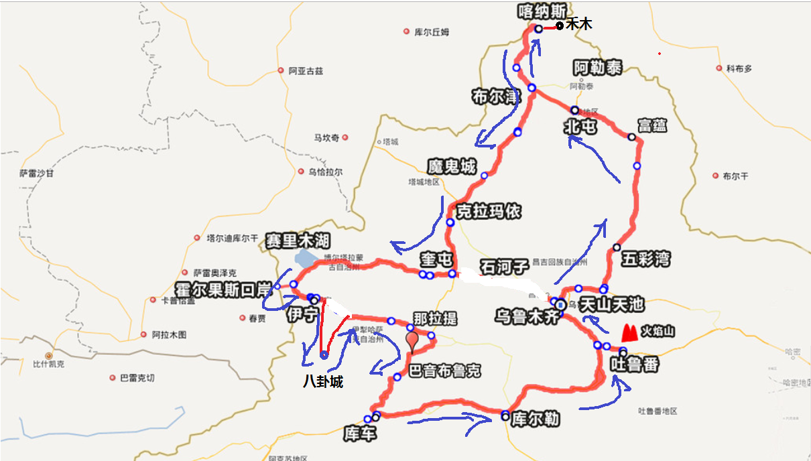
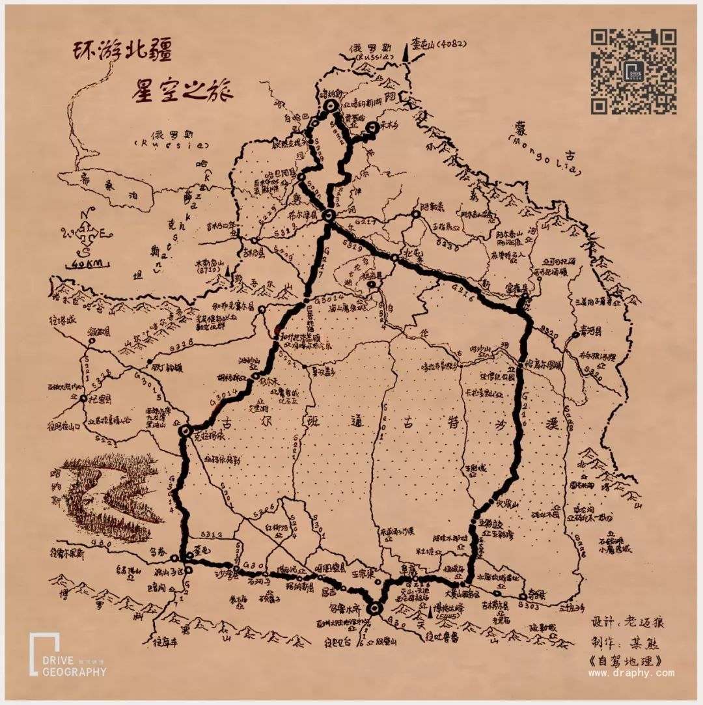
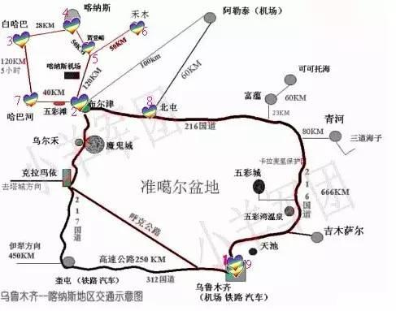
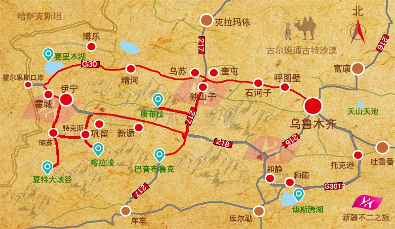

# 新疆简介

### 1. 地理位置 
   地处亚欧大陆腹地，周边与俄罗斯、哈萨克斯坦、吉尔吉斯斯坦、塔吉克斯坦、蒙古、巴基斯坦、印度、阿富汗斯坦八国接壤，在历史上是古丝绸之路的重要通道，现在是第二座“亚欧大陆桥”的必经之地，战略位置十分重要。新疆现有47个民族成分，主要居住有汉、维吾尔、哈萨克、回、蒙古、柯尔克孜、锡伯、塔吉克、乌孜别克、满、达斡尔、塔塔尔、俄罗斯等民族，是中国五个少数民族自治区之一。
### 2. 南北疆分界线 
   新疆人喜欢把新疆分为南疆北疆来称呼，而南北疆的分界线是以天山以南和天山以北来分界。天山以南的称为南疆，天山以北的称为北疆。
南疆主要体验人文而北疆主要以自然风景为主。而吐鲁番、鄯上沙漠则属于东疆的范围。

  
  

# 行程

  
  
  
  

## 【第1天, 8.01】 乌鲁木齐---天池---北屯（约620公里，行车约9小时）
   
   ---------------
## 【第2天, 8.02】北屯--布尔津县-哈巴河县-铁热克提乡-喀纳斯湖（约257公里，行车约5.5小时）
## 【第3天, 8.03】喀纳斯湖-白哈巴-贾登峪国家森林公园-禾木乡（约223公里，行车约5.5小时）
#___or___
## 【第2天, 8.02】北屯--阿勒泰大草原→禾木（约260公里，行车约6小时）
## 【第3天, 8.03】禾木--喀纳斯-五彩滩--布尔津（约223公里，行车约5.5小时）
#___or___
## 【第2天, 8.02】北屯--喀纳斯→贾登峪（约280公里，行车约4小时）
## 【第3天, 8.03】贾登峪---禾木（约60公里，行车2小时）
   ---------------
   
## 【第4天, 8.04】禾木乡-冲乎尔乡-布尔津县-乌尔禾镇魔鬼城-克拉玛依市（约500公里，行车约7小时）
  
## 【第5天, 8.05】乌尔禾---赛里木湖（约540公里，行车约6小时）

## 【第6天, 8.06】赛里木湖---阔克苏大峡谷-八卦城特克斯（约270公里，行车约4小时）

## 【第7天, 8.07】特克斯-喀拉峻-那拉提（约223公里，行车约4小时）

## 【第8天, 8.08】那拉提--天鹅湖-九曲十八弯-巴音布鲁克（约84公里，行车约2小时）

## 【第9天, 8.09】巴音布鲁克--独库公路(库车大峡谷)---库车（约257公里，行车约5小时）

## 【第10天, 8.10】库车----火焰山---鄯善（约774公里，行车约10小时）

## 【第11天, 8.11】鄯善--坎儿井--葡萄庄园--乌鲁木齐（约300公里，行车约4.5小时）

#[具体行程](./detail.md)

#参考

>***[马蜂窝北疆](https://www.mafengwo.cn/travel-scenic-spot/mafengwo/10757.html)***  
>***[新疆各地旅游线路大全](https://www.sohu.com/a/244838612_100013181)***  
>***[第一次来新疆如何玩得爽？看这篇攻略就够了](http://www.mafengwo.cn/gonglve/ziyouxing/5773.html)***  
>***[2017北疆](https://you.ctrip.com/travels/chugokuchiho21364/3706875.html)***  
>***[新疆8日精品游](http://www.mafengwo.cn/sales/2689766.html)***  
>***[地图](https://baijiahao.baidu.com/s?id=1625170453362520848&wfr=spider&for=pc)***  

