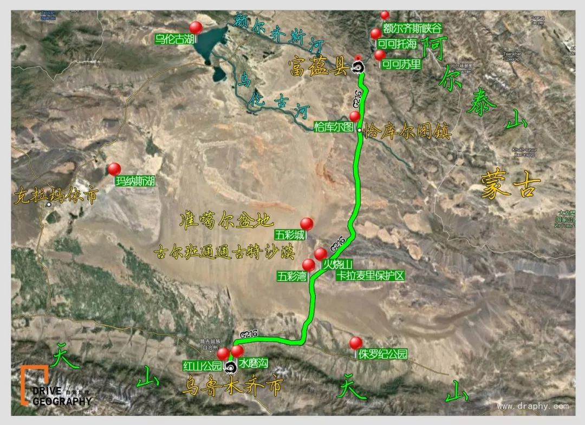
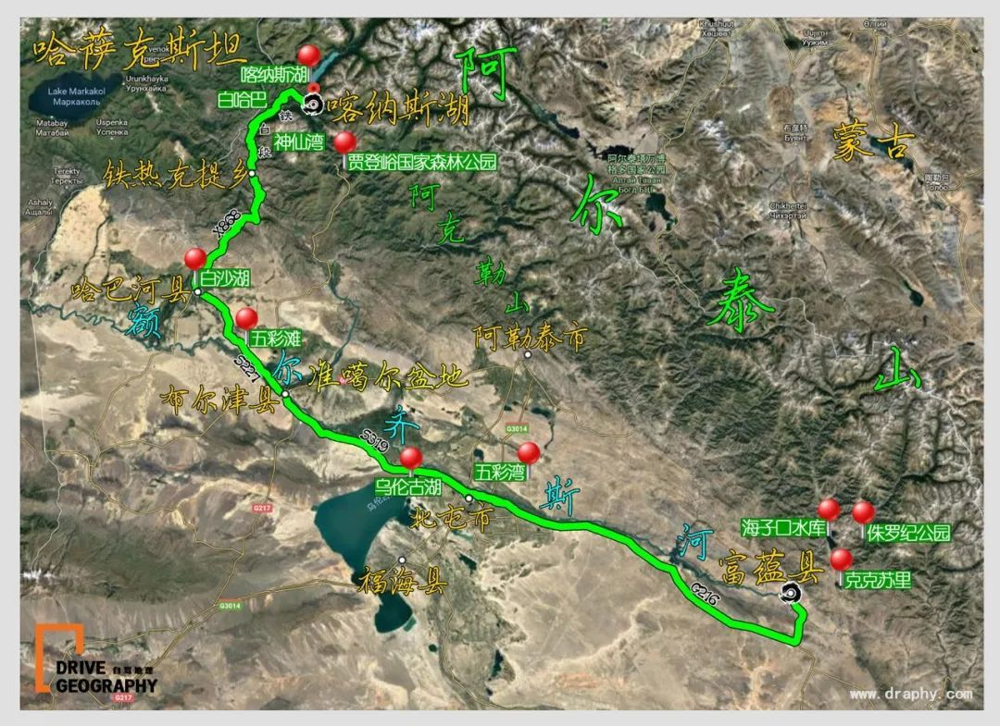
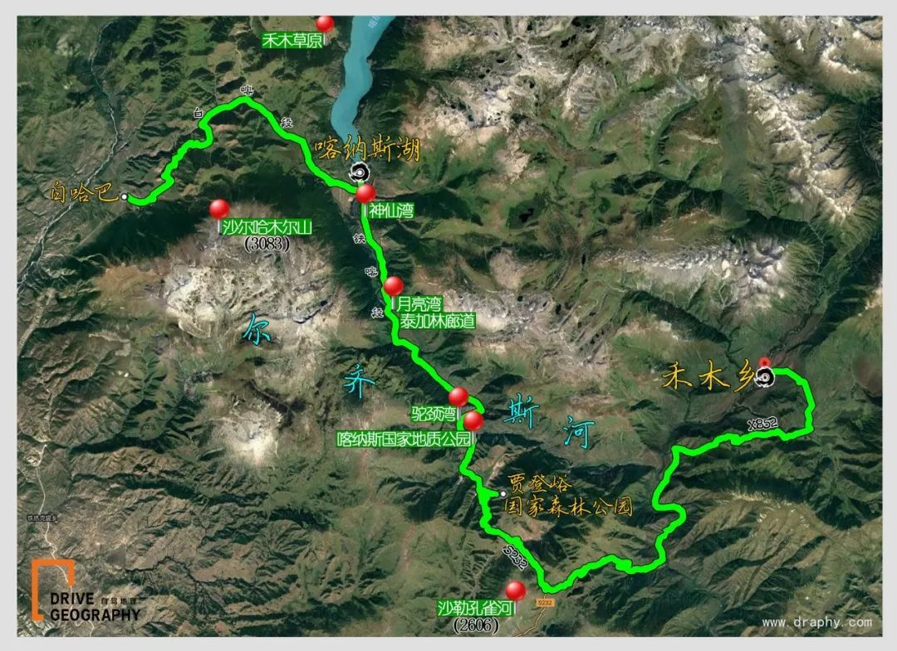
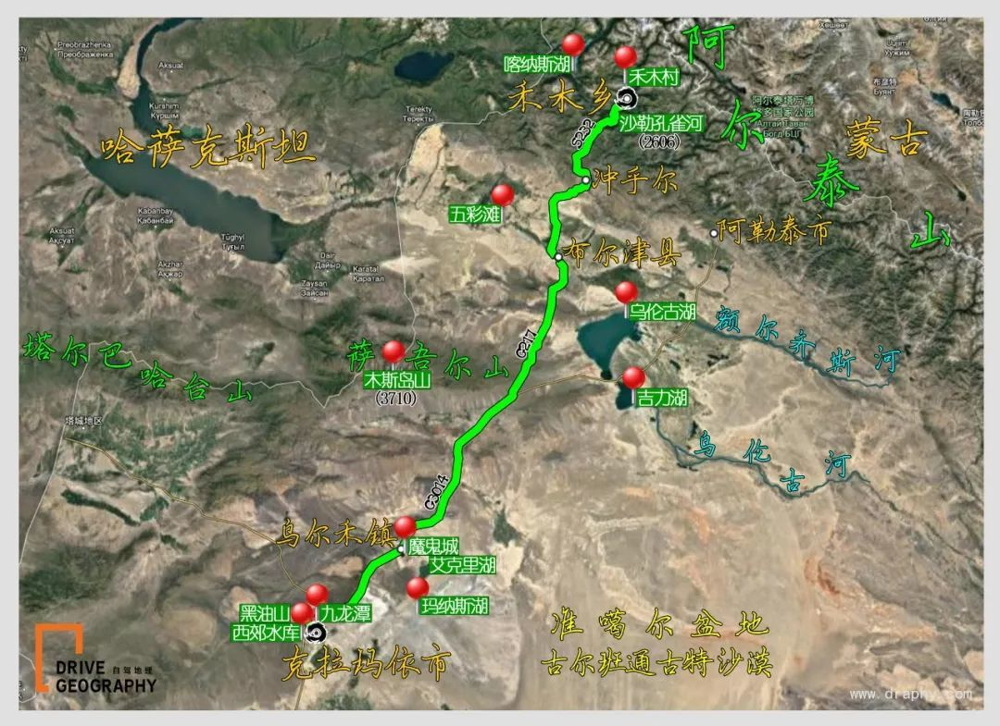
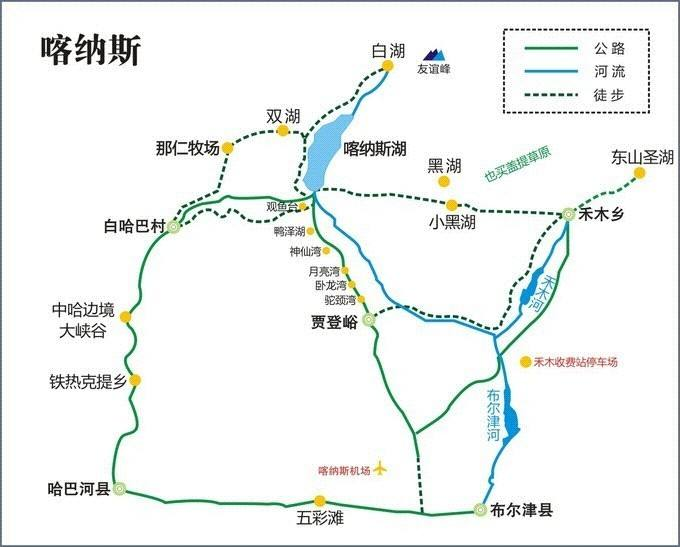
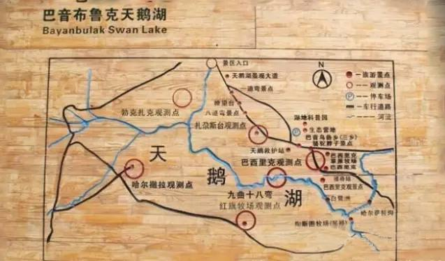

# 新疆简介

### 1. 地理位置 
   地处亚欧大陆腹地，周边与俄罗斯、哈萨克斯坦、吉尔吉斯斯坦、塔吉克斯坦、蒙古、巴基斯坦、印度、阿富汗斯坦八国接壤，在历史上是古丝绸之路的重要通道，现在是第二座“亚欧大陆桥”的必经之地，战略位置十分重要。新疆现有47个民族成分，主要居住有汉、维吾尔、哈萨克、回、蒙古、柯尔克孜、锡伯、塔吉克、乌孜别克、满、达斡尔、塔塔尔、俄罗斯等民族，是中国五个少数民族自治区之一。
### 2. 南北疆分界线 
   新疆人喜欢把新疆分为南疆北疆来称呼，而南北疆的分界线是以天山以南和天山以北来分界。天山以南的称为南疆，天山以北的称为北疆。
南疆主要体验人文而北疆主要以自然风景为主。而吐鲁番、鄯上沙漠则属于东疆的范围。

# 行程

## 【第1天, 8.01】 乌鲁木齐---天池---北屯（约620公里，行车约9小时）

###景点
1. 乘车赴著有“天山明珠”之称的（含天池门票+区间车）,抵达后转乘区间车上天池，观石门一线、定海神针、大小天池、悬泉飞瀑、遥望美丽的博格达雪峰[天山东段最高峰，海拔5495米]等天池八景。
2. 当日行程全程国道，途经壮丽的古尔班通古沙漠观戈壁风光，经过准噶尔盆地边缘的卡拉麦里有蹄类自然保护区，有幸的话您还可以看到黄羊、野马等野生动物，观奇异的火烧山，公路沿我国唯一注入北冰洋的“银水”—额尔齐斯河前行，晚抵达北屯入住酒店；由于国道216经过的是准噶尔野生动物保护区，经常有野生动物出没，小心避让。
- [ ] 富蕴, 可可托海，全国第二冷极，90元/人，观光车50-70元/人。  

### 沿途美食
推荐文化东路14号（新步行街和谐小区商品楼108号门面观光电梯下）有家品味椒麻鸡，内有地方菜色，人均20元；库额尔齐斯镇步行街佳贝爱儿童游乐园楼上的君缘食府，也是地方菜品。

## 【第2天, 8.02】北屯--布尔津县-哈巴河县-铁热克提乡-喀纳斯湖（约257公里，行车约5.5小时）
里程: 90km  -  55km-75km-70km

###景点
1. 五彩滩，神奇西北100景之一，50元/人
2. 晚上可先去贾登峪国家森林公园，这里是捕捉英仙座流星雨的绝佳地之一

### 沿途美食
布尔津: 冷水鱼
喀纳斯景区里的餐饮消费很贵，且山上的餐厅较少，所以尽量带足干粮

### 住宿推荐
喀纳斯后来小院
地址：喀纳斯老村最后一家也是最靠近喀纳斯湖的一家
电话：18097507221
房价：大床房/标间260~1200

四季休闲酒店
地址：贾登峪门票站西150米，近贾登峪门票站
电话：0906-6328888
标间：266-318（免）

## 【第3天, 8.03】喀纳斯湖-白哈巴-贾登峪国家森林公园-禾木乡（约223公里，行车约5.5小时）
里程：30km-60km-65km，总里程155km

日行程多以盘山路居多，出喀纳斯后会途经二段盘山路，路面狭窄，车多，尤其是摩托车，要注意车距和行车安全；在禾木村周围的小山坡上可俯视禾木村以及禾木河的全景，远观日出、雪峰，近览图瓦人家，是拍摄的绝佳取景地。

禾木门票站的班车到禾木村。车慢悠悠的以40km/h爬行，经过一个小时左右到禾木村游客运转中心。禾木村游客运转中心有区间车、在禾木村往返
禾木村很大、游客弄不好会迷路、找不到客栈。我自己光顾着玩了、既没有记客栈的名称、又没有记老板的电话，天黑迷路、到110边防警察派出所，警察忙着在电脑上查，派警车把我们送到了客栈门口、客栈老板吓坏了。
禾木村玩的地方有、禾木村庄、禾木河、点将台、白桦林、放牧草场、美丽峰、美丽村。玩的项目有，漂流、骑马等等。就看你玩几天。
    
### 景点
1. 白哈巴，西北第一村/第一哨，50元/人
2. 禾木乡，神在后花园的自留地，60元/人

### 沿途美食
推荐禾木乡桥头第一家康氏一绝牛肉面内的牛肉面。

### 住宿推荐
禾木时光里摄影主题客栈（《自驾地理》认证）  
地址：禾木老村禾木大桥下游方向两百米河边
电话：13786154942
大床房/标间：300~980（你能突破景区开到客栈门口，就能免费）

乌托邦客栈
地址：禾木村259号
电话：13565909656
标间：458起（免费停车）

## 【第4天, 8.04】禾木乡-冲乎尔乡-布尔津县-乌尔禾镇-克拉玛依市（约500公里，行车约7小时）
里程：100km-70km-230km-100km，总里程500km

当日行车时间较长，建议早起出发；过冲乎尔镇，开抵布尔津县，沿途景色优美，路上不时有巨大的哈萨克族墓冢，蔚为壮观；和什托洛盖镇地段，是一个煤矿区域，拉煤车很多，路上灰尘大，关车窗行驶，过和什托洛盖镇，到达乌尔禾区，中途可以开往当地的魔鬼城、油砂山等景点游玩一番，看裸露的石层被狂风雕琢得奇形怪状；出乌尔禾区后进入石油井架林立的克拉玛依油田，路边全是石油井架，十分壮观，开往克拉玛依沿途则是一望无际的条田和林立的白杨，可以边走边欣赏，注意路上的拖拉机。
  
### 景点
1. 途景色优美，路上不时有巨大的哈萨克族墓冢，蔚为壮观
2. 乌尔禾区魔鬼城、油砂山等景点游玩一番
3. 石油井架林立的克拉玛依油田，路边全是石油井架，十分壮观
4. 一望无际的条田和林立的白杨

### 沿途美食
克拉玛依区光明东路7号(近采油一厂)的克拉玛依喜欢火锅可以试一试；景园路9号（森香水岸会所附近）的中餐厅（恒隆国际酒店）有餐饮提供。

### 住宿推荐
恒隆国际酒店
地址：克拉玛依 克拉玛依区 兴生路172号，近新兴路
电话：0990-7565656
标间：248（含早，免停）

锦江之星(克拉玛依行政中心店)
地址：克拉玛依 克拉玛依区 广源路36号，宝石路与迎宾路交汇处可见
电话：0990-6668666
标间：189-246（免停）

## 【第5天, 8.05】乌尔禾---赛里木湖（约540公里，行车约6小时）
里程：100km-70km-230km-100km，总里程500km

当日行车时间较长，建议早起出发；过冲乎尔镇，开抵布尔津县，沿途景色优美，路上不时有巨大的哈萨克族墓冢，蔚为壮观；和什托洛盖镇地段，是一个煤矿区域，拉煤车很多，路上灰尘大，关车窗行驶，过和什托洛盖镇，到达乌尔禾区，中途可以开往当地的魔鬼城、油砂山等景点游玩一番，看裸露的石层被狂风雕琢得奇形怪状；出乌尔禾区后进入石油井架林立的克拉玛依油田，路边全是石油井架，十分壮观，开往克拉玛依沿途则是一望无际的条田和林立的白杨，可以边走边欣赏，注意路上的拖拉机。
  
### 景点
1. 途观克拉玛依百里油田采油区
2. 高原明珠的塞里木湖，又称“三台海子”

### 沿途美食
克拉玛依区光明东路7号(近采油一厂)的克拉玛依喜欢火锅可以试一试；景园路9号（森香水岸会所附近）的中餐厅（恒隆国际酒店）有餐饮提供。

### 住宿推荐
恒隆国际酒店
地址：克拉玛依 克拉玛依区 兴生路172号，近新兴路
电话：0990-7565656
标间：248（含早，免停）

锦江之星(克拉玛依行政中心店)
地址：克拉玛依 克拉玛依区 广源路36号，宝石路与迎宾路交汇处可见
电话：0990-6668666
标间：189-246（免停）

## 【第6天, 8.06】赛里木湖---阔克苏大峡谷-八卦城特克斯（约270公里，行车约4小时）

## 【第7天, 8.07】特克斯-喀拉峻-那拉提（约223公里，行车约4小时）

## 【第8天, 8.08】那拉提--天鹅湖-九曲十八弯-巴音布鲁克（约84公里，行车约2小时）

## 【第9天, 8.09】巴音布鲁克--独库公路(库车大峡谷)---库车（约257公里，行车约5小时）

## 【第10天, 8.10】库车----火焰山---鄯善（约774公里，行车约10小时）

## 【第11天, 8.11】鄯善--坎儿井--葡萄庄园--乌鲁木齐（约300公里，行车约4.5小时）

## 【第2天, 8.02】北屯--喀纳斯→贾登峪（约280公里，行车约4小时）

早乘车赴【喀纳斯景区】进入喀纳斯国家地质公园（含门票+一进区间车），喀纳斯景区位于新疆北部的阿尔泰山中段，地处中国与哈萨克斯坦、俄罗斯、蒙古国接壤的黄金地带，自然生态景观和人文景观始终保持着原始风貌而被誉为“人间净土”，素有东方瑞士之称。沿喀纳斯河一路观光，欣赏原始森林、白桦林风景，途中停靠著名的月亮湾、卧龙湾、神仙湾，观喀纳斯图佤人村落，，感受民族风俗，聆听天籁之音苏尔乐器。；晚住贾登峪酒店。
图瓦人家访
## 【第3天, 8.03】贾登峪---禾木（约60公里，行车2小时）

早餐后乘车前往神的后花园-人间天堂【禾木乡】(含门票+维护费+区间车）参观游览。在小河、木屋、炊烟、桦林以及木桥上放牧的牧羊人中，宛如走进了传说中霍比特人的家园-夏尔国，参观游览。(如遇不可抗力因素下可调换白沙湖)。下午返回布尔津，参观中国唯一注入北冰洋的河流-额尔齐斯河畔【含五彩滩门票】观赏集河流、森林、吊桥、夕阳及河心姐妹岛为一体”天下第一滩”之美景，后入住酒店。

## 【第4天, 8.04】禾木---乌尔禾魔鬼城（约420公里，行车约7小时）
吃,
沿途观准葛尔西戈壁荒漠风光，参观神奇的【含乌尔禾魔鬼城门票】，它是新疆最大的典型内陆风蚀地貌，浓缩雅丹特征的地质奇观。

## 【第5天, 8.05】乌尔禾---赛里木湖（约540公里，行车约6小时）

## 【第6天, 8.06】赛里木湖---阔克苏大峡谷-八卦城特克斯（约270公里，行车约4小时）
## 【第6天, 8.06】赛里木湖---昭苏（约258公里，行车约5小时）

## 【第7天, 8.07】特克斯-喀拉峻-巩留（约70公里，行车约1.5小时）
## 【第7天, 8.07】特克斯-喀拉峻-那拉提（约223公里，行车约4小时）

## 【第8天, 8.08】巩留-巴音布鲁克（约235公里，行车约4.5小时）
## 【第8天, 8.08】那拉提--天鹅湖-九曲十八弯-巴音布鲁克（约84公里，行车约2小时）

## 【第9天, 8.09】巴音布鲁克--独库公路(库车大峡谷)---库车（约257公里，行车约5小时）
___只有一段独库公路___ 

晚上宿库车,古称龟兹（qiuci）这里的馕坑肉也是大众点评上找的，太好吃了

## 【第10天, 8.10】库车----火焰山---鄯善（约774公里，行车约10小时）

## 【第11天, 8.11】鄯善--坎儿井--葡萄庄园--乌鲁木齐（约300公里，行车约4.5小时）

## 【第5天, 8.05】博乐---赛里木湖-果子沟大桥-薰衣草基地-那拉提镇（约480公里，行车约6小时）
早乘车赴那拉提，途中游览被誉为高原明珠的塞里木湖，又称“三台海子”，（含塞里木湖费用），后沿风景如画的果子沟盘山公路赴伊宁，果子沟
是伊犁河谷的门户，白云蓝天，雪山松树，峰回路转，风光旖旎。沿途观光东方普罗旺斯，位于伊犁州霍城县，这里也是中国薰衣草种植面积和密度最大的地方，每年六七月份，在霍城的公路两旁都有大面积的薰衣草田可以观赏拍摄，而解忧公主薰衣草园内既有视野开阔的薰衣草田，还有多种花卉构成的七彩花田及田间浪漫的雕塑造型，是附近拍摄花田最好的地方。而且园内还有关于薰衣草及精油知识的博物馆，可以更好的了解关于薰衣草的知识。晚住那拉提镇。
赠送：【薰衣草基地】

## 【第6天, 8.06】那拉提---巴音布鲁克-天鹅湖-九曲十八弯--和静（约320公里，行车约4小时）
                     
早餐后乘区间车进入（含那拉提景区门票+河谷草原区间车），也可自
费骑马游那拉提草原，观新疆山地草原风光，徒步观景摄影拍照。午餐后乘车赴（含巴音布鲁克草原门票+区间车），感受巴音布鲁克大草原的辽阔、平坦，蓝天、白云、草原、羊群让您真实领略迷人的塞外风光, 途观中国最大的内陆淡水湖博斯腾湖的源头—开都河，赴我国唯一的天鹅自然保护区—天鹅湖观光，寻觅天鹅的优美身姿，可观迷人的九曲十八弯风光，感受蒙古人的热情豪放，后乘车至和静。

## 【第7天, 8.07】和静--火焰山---吐鲁番，（约350公里，行车约6小时）
     
早餐后沿翻越干沟沿途风光前往吐鲁番，到达后游览童山秃顶，草木不生的【含火焰山门票】、一边看风景一边追孙悟空借寻铁扇公主铁扇扇灭火焰山的故事。游览最具民族特色古建筑- 

## 【第8天, 8.08】吐鲁番--坎儿井--葡萄庄园--乌鲁木齐（约220公里，行车约3小时）

早餐后参观吐鲁番人民这种神奇的饮水灌溉工程—【坎儿井已含】，让
我们去细细地体味，引来的雪水把他浇灌是怎么样的过程！后参观【葡萄庄园】（游览时间不少于40分钟）茂密的葡萄藤下，欢快的新彊舞曲响起，热烈的步姿起舞，游客可以自行购买具有新疆特色的烤包子、羊肉串，一边品尝一边欣赏美美的舞姿，悦目爽心！后前往【吐鲁番维吾尔族家访】（赠送)（游览时间约50分钟），学习迷人的西域风情舞蹈，品尝特色水果，感受维吾尔族人民葡萄架下的惬意生活；午餐后游览后返回乌鲁木齐！（参观百石缘或国石玉器加工厂或吐鲁番玉石展览馆，了解玉石文化）。

## 【第9天, 8.09】
## 【第10天, 8.10】
## 【第11天, 8.11】

乘车赴著有“天山明珠”之称的（含天池门票+区间车）,抵达后转乘区间车上天池，观石门一线、定海神针、大小天池、悬泉飞瀑、遥望美丽的博格达雪峰[天山东段最高峰，海拔5495米]等天池八景，后
1. -->北屯
2. --> 喀纳斯→贾登峪
3. 贾登峪--> 禾木
4. 禾木 -> 乌尔禾魔鬼城
5. --> 乌尔禾魔鬼城
6. --> 赛里木湖
7. --> 阔克苏大峡谷-八卦城特克斯 (or 昭苏)
8. 特克斯-喀拉峻-巩留(那拉提)
9. 巩留-巴音布鲁克
10. 巴音布鲁克-天鹅湖-九曲十八弯--托克逊
11. 托克逊-火焰山---吐鲁番--坎儿井--葡萄庄园--乌鲁木齐

Day5：乌尔禾-赛里木湖；
     Day6：赛里木湖-阔克苏大峡谷-八卦城特克斯；
     Day7：特克斯-喀拉峻-巩留(那拉提)；
     Day8：巩留-巴音布鲁克；
     Day9：巴音布鲁克-托克逊；
     Day10：托克逊-鄯善；
     Day11：鄯善-吐鲁番-乌鲁木齐。

Day1：各地-乌鲁木齐 管家接机，安排酒店入住（住乌鲁木齐）

Day2：乌鲁木齐→巴音布鲁克

Day3：巴音布鲁克→那拉提

Day4：那拉提→博乐

Day5：博乐→布尔津

Day6：布尔津→喀纳斯→贾登峪

Day7：贾登峪→禾木→福海

Day8：福海→乌鲁木齐

Day9：乌鲁木齐→吐鲁番

Day10：乌鲁木齐→天池

